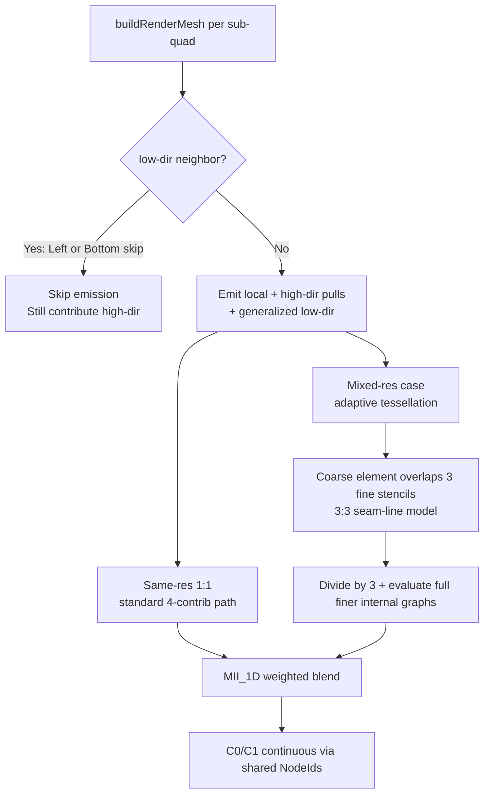

# Mermaid Diagram Guide

This skill equips you with essential knowledge to create Mermaid diagrams that render without syntax errors. It focuses on proven patterns that handle common pitfalls encountered when diagrams involve complex labels, flowcharts with branching, sequence flows, and renderer-specific quirks (such as GitHub's Mermaid support).

## Usage

When your task involves writing or revising Mermaid diagrams (e.g., "create a flowchart for this process", "fix the syntax error in this diagram", "add a sequence diagram to the design doc"), read this skill first. Apply the rules below to produce clean, renderable output.

Copy-paste examples of invocation:
- "Create a Mermaid flowchart showing the retry logic for the feature."
- "Review and fix any Mermaid syntax issues in the attached design."
- "Add diagrams to illustrate the contributor flow and the seam model."

## Core Loop

1. **Choose diagram type wisely**:
   - Use `flowchart` (TD for top-down, LR for left-right) for processes, decisions, and data flows.
   - Use `sequenceDiagram` for interactions, steps over time, or multi-party flows (more tolerant of complexity).
   - Avoid overusing advanced features (subgraphs, class diagrams) unless necessary and tested.

2. **Write node labels safely**:
   - For any label containing spaces, numbers in expressions (e.g., sr*3+sc), special characters (*, /, (, ), :, -, +, =, <, >, ?, & , | , % , etc.), or markdown-like symbols: **always** wrap in double quotes with the appropriate shape brackets: `NodeID["Label with * and (stuff)"]`. Use `("text")`, `{"text"}`, or `["text"]` as needed.
   - Simple alphanumeric labels without specials or spaces can use bare `NodeID[Simple Label]`.
   - For line breaks inside labels: use `<br>` (plain, **not** self-closing `<br/>`) inside the quoted label: `NodeID["Line one<br>Line two"]`. For richer formatting, consider backtick-wrapped markdown strings + `htmlLabels: false` config.
   - Treat bare "end" (or other reserved words like certain link starters) as a trigger for quoting or aliasing (e.g., `E as "End state"` in sequence diagrams).

3. **Structure for robustness**:
   - Keep flowcharts simple: avoid deep nesting of decisions that immediately branch again in ways that confuse parsers. Use clear top-to-bottom (TD) or left-to-right (LR) flow. Quote decision labels inside `{}`: `{"cond (with && || expr)"}`.
   - In sequence diagrams: participants, arrows with labels, notes, alt/opt/loop/critical blocks are generally more tolerant of complexity than intricate flowcharts.
   - Use descriptive but clean node/participant IDs (alphanumeric + `_` / `-` only). Put all display text (math, conditions, paths) in quoted labels.
   - Indent the Mermaid code block content consistently. Declare subgraphs and nodes in logical order; always match every `subgraph` with `end`. Quote subgraph titles that contain specials.

4. **Handle common errors proactively**:
   - "Syntax error in text" / parse errors: Almost always an unquoted label with special characters (especially `*` in math like `sr*3+sc`, or parentheses/slashes/colons). Quote the full label first.
   - Line break / `<br/>` issues: Replace any self-closing `<br/>` with plain `<br>`. Test inside quotes.
   - Branching/flow / "nodes inside nodes" errors: Simplify structure or split into multiple diagrams. Avoid unquoted brackets/braces inside labels.
   - Subgraph "end" traps or nesting failures: Explicitly quote titles with specials; add `direction` inside only when safe; test incrementally.
   - Edge/arrow label issues: Quote inside `| |` or use `--"label"--> ` for labels with specials.
   - Renderer differences: Always validate in a live editor (mermaid.live or equivalent) that matches your target platform (e.g., GitHub preview). GitHub uses a specific Mermaid version in an iframe; quote aggressively and keep diagrams focused.
   - Long labels or "end" conflicts: Split with `<br>`; alias risky words.
   - For iterative fixes: Identify the error → apply quoting + `<br>` rules first → simplify structure → re-validate. Repeat until clean.

5. **Validate and iterate**:
   - After writing, render the diagram immediately in your target environment.
   - If errors appear, apply the quoting + `<br>` rules first.
   - For GitHub-specific rendering: quote aggressively, use `<br>`, keep diagrams under ~20-30 nodes if possible.
   - Re-test after any edit.

6. **Enhance for clarity (optional but recommended)**:
   - Use subgraphs sparingly and only when they add value (test them).
   - Add titles or captions outside the diagram block.
   - Use consistent styling (e.g., different node shapes for start/end vs. process vs. decision).
   - Keep diagrams focused — one concept per diagram.

## Common Pitfalls (to Avoid by Default)

- Unquoted labels with special chars (*, /, (, ), :, ?, +, =, &, |, %, etc.) or math expressions (sr*3+sc) — always quote the full label.
- Self-closing <br/> in labels — use plain <br>.
- Bare "end" (reserved for subgraphs) in labels — quote or alias.
- "o" or "x" as first char of node ID right after a link (e.g., A---oB) — add space or capitalize.
- Unquoted brackets/braces inside labels (creates "nodes inside nodes").
- Malformed subgraphs (missing end, unquoted titles with specials, wrong nesting).
- Complex unquoted edge/arrow labels.
- Overly complex branching without testing; very long single-line labels.

## Rules

- Default to quoting **every** node label unless it is a single clean word with no punctuation, symbols, spaces, or operators. This prevents ~90% of "Syntax error in text" issues.
- Never use self-closing `<br/>` in labels — use plain `<br>`.
- Treat `*` (in math expressions like sr*3+sc), bare "end", and any non-alphanumeric as a guaranteed trigger for full quoting of the label.
- Sequence diagrams are generally more tolerant than complex flowcharts for step-by-step or multi-party flows.
- Always produce diagrams that can be copy-pasted into a live Mermaid editor (mermaid.live or equivalent) and render perfectly before committing.
- If the diagram is for a design, plan, or doc, ensure the Mermaid block is self-contained and referenced clearly in surrounding prose (e.g., "See the diagram below for the flow.").
- Do not introduce project-specific details, file paths, or implementation names into the diagrams or guidance.
- For iterative fixes: identify the error (usually unquoted specials), apply quoting + `<br>` rules first, simplify structure (fewer deep branches, no unquoted brackets inside labels), re-validate in target renderer. Repeat until clean.
- Validate early in the exact target environment (GitHub preview, etc.). Quote aggressively for GitHub compatibility; keep diagrams focused (one concept per diagram, ~20-30 nodes max for complex flows).
- Use `%% comments` on their own lines. Prefer core syntax over bleeding-edge features unless you have pinned the renderer version.

## Example (Generic)

**Before (common errors that fail to render):**
```mermaid
flowchart TD
    A[buildRenderMesh per sub-quad q=sr*3+sc] --> B{low-dir neighbor?}
    B -->|Yes (Left/Bottom skip)| C[Skip emission; still contribute high-dir]
    B -->|No| D[Local + high-dir pulls + generalized low-dir]
    D --> E[For same-res 1:1 stencil alignment: unchanged 4-contrib pull]
    E --> F[MII_1D(v_xi, v_eta) weighted blend]
    D --> G[Future: size-mismatch case]
    G --> H[Coarse element (1 primitive quad) overlaps 3 fine stencils along seam]
    H --> I[Divide coarse MII influence by 3; add scaled contrib to each of 3 fine sub-quads]
    I --> J[Fine side: regular per-node eval at its denser points]
    J --> F
    F --> K[C0/C1 continuous surface via shared NodeIds on true seam]
```

**After (robust, renders reliably):**


Note the quoting, use of `<br>` (no slash), simplified structure, and clean labels.

## Success Criteria

- The produced Mermaid code renders without any syntax errors in the target platform (e.g., GitHub Markdown preview).
- No repeated "Syntax error in text" or similar after applying the quoting and line-break rules.
- Diagrams are clear, focused, and use the appropriate type (flowchart vs. sequence).
- The skill user can create new diagrams or fix existing ones in one or two iterations without external debugging.
- Output is fully project-agnostic and reusable.

**Quick Checklist (use before committing any diagram):**
- [ ] Node/participant IDs are simple (alphanumeric + _/-, start with letter).
- [ ] Every label with spaces, punctuation, *, /, (, ), :, ?, etc. is quoted: ID["text"] or ID{"text?"}.
- [ ] Line breaks use <br> (not <br/>) inside quotes.
- [ ] Decisions use {} shape; quote complex conditions inside.
- [ ] Subgraphs (if any): titles quoted if special chars; every subgraph has matching end.
- [ ] Edge labels quoted if they contain specials.
- [ ] Validated in live editor (mermaid.live) + target renderer (e.g. GitHub preview).
- [ ] Diagram is focused (one concept); "end" and reserved words handled.
- [ ] No unquoted brackets/braces inside labels.

## References

- Mermaid official documentation (syntax for flowchart, sequenceDiagram, node labeling, and line breaks).
- Common platform-specific rendering notes (GitHub Flavored Markdown Mermaid support and known quirks).
- The broader meta-system for skills: init/done for durable context, handoffs/README for portable memory, concise vs. involved skill styles for documentation quality.
- Patterns from parallel research and design skills: prospect first, use researcher subagents when deeper analysis is needed (e.g., to identify additional pitfalls), keep guidance lean and actionable.

---

*This skill was created to encapsulate reliable Mermaid authoring practices. Update it when new renderer quirks or best practices are discovered. Always prioritize quoting and simplicity for cross-platform compatibility.*
